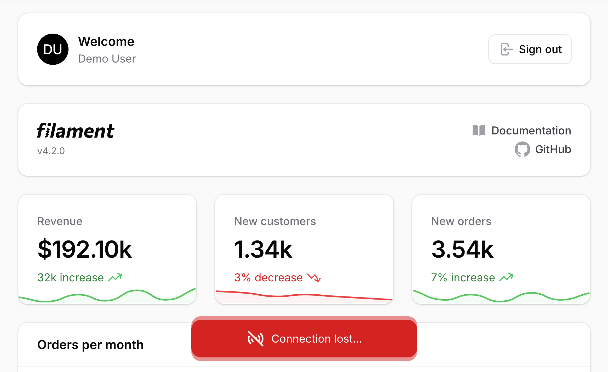

# Filament Offline Notice

[](https://packagist.org/packages/charlieetienne/filament-offline-notice)
[](https://github.com/charlieetienne/filament-offline-notice/actions?query=workflow%3Arun-tests+branch%3Amain)
[](https://github.com/charlieetienne/filament-offline-notice/actions?query=workflow%3A"Fix+PHP+code+styling"+branch%3Amain)
[](https://packagist.org/packages/charlieetienne/filament-offline-notice)



A Filament plugin displaying a notice when you're offline.

## Installation

You can install the package via composer:

```bash
composer require charlieetienne/filament-offline-notice
```

Optionally, you can publish the views using

```bash
php artisan vendor:publish --tag="filament-offline-notice-views"
```

## Usage

Register the plugin in your Panel Provider, for example in `app/Providers/Filament/AdminPanelProvider.php`:

```php
use CharlieEtienne\FilamentOfflineNotice\FilamentOfflineNoticePlugin;

return $panel
    ->plugins([
        FilamentOfflineNoticePlugin::make(),
    ]);
```

## Testing

```bash
composer test
```

## Changelog

Please see [CHANGELOG](CHANGELOG.md) for more information on what has changed recently.

## Contributing

Please see [CONTRIBUTING](.github/CONTRIBUTING.md) for details.

## Security Vulnerabilities

Please review [our security policy](../../security/policy) on how to report security vulnerabilities.

## Credits

- [Charlie Etienne](https://github.com/CharlieEtienne)
- [All Contributors](../../contributors)

## License

The MIT License (MIT). Please see [License File](LICENSE.md) for more information.
